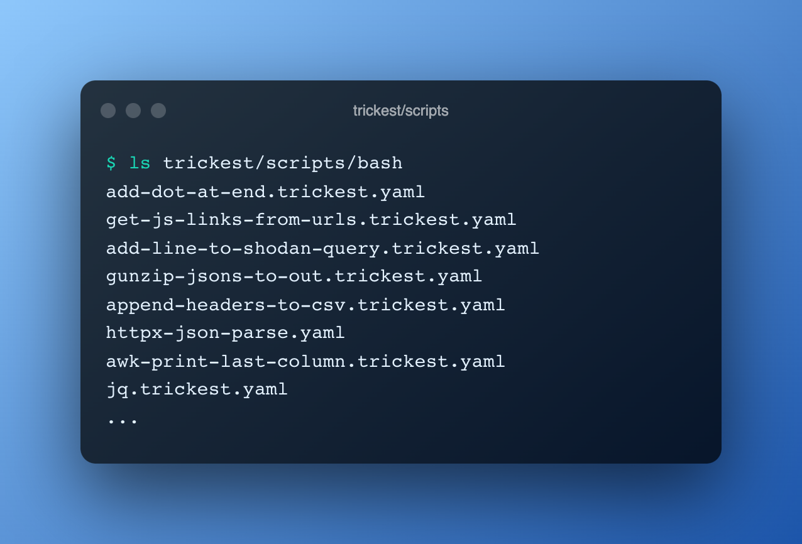

<h1 align="center">Scripts </h1>
<h3 align="center">Handy scripts and one-liners to make life easier</h3>

This repository contains some useful scripts that are designed to do small tasks such as:
- Parsing the output of a tool to make it easier to read.
- Cleaning up a file so that it can be processed by a tool.
- Collecting various kinds of data from multiple sources.

Check out the [YAML files](bash) or [scripts.md](scripts.md) for a complete list.
## Contribution
All contributions/ideas/suggestions are welcome! Feel free to create a new ticket via [GitHub issues](https://github.com/trickest/scripts/issues), tweet at us [@trick3st](https://twitter.com/trick3st), or join the conversation on [Discord](https://discord.gg/7HZmFYTGcQ). Check out the [contribution guidelines](CONTRIBUTING.md) for more details.

## See scripts in action!
Scripts are an essential part of Trickest workflows. Sign up for a demo on [trickest.com](https://trickest.com) to see these scripts in action and learn how they fit into the bigger picture of a complete automation solution!
